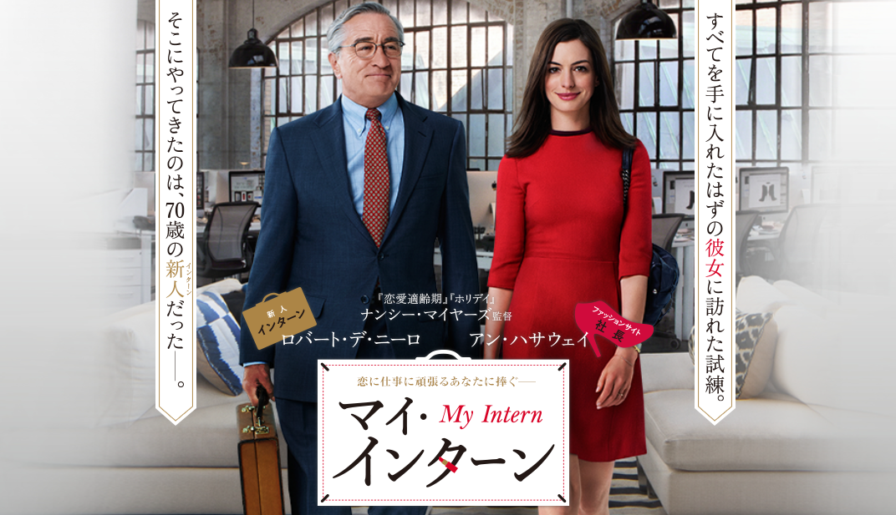

# マイ・インターン（吹替版）

## きっかけ

友達に教えてもらった

## 媒体

プライムビデオ

## おとも

水

## 感想

- 冒頭の応募用ビデオの言葉選びが好き
- アンハサウェイの仕事できる感
- ジュールズがママ友の中では不評なのが可哀そうだけどしょうがないと思った
- ジュールズが梱包を指導するシーンで，ジュールズの仕事への情熱を描いていたのがかっこよかった
- 夫に浮気されて一番つらいのが「一人でお墓に入ること」なのかわいい
- ベンが運転手やジュールズの夫に，直接的ではない言い方で諭すのがかっこよかった
- ベンの仕事仲間とのグータッチ胸熱だった
- 映画後半になるにつれて，ベンの仕事仲間たちがベンに影響されてスーツを着るようになったり，身なりを整えたり，クラシックなブリーフケースを持つようになったのが目立たないけど描かれていた
- 最後に付いていた特典映像のインタビューもかなり良かった
