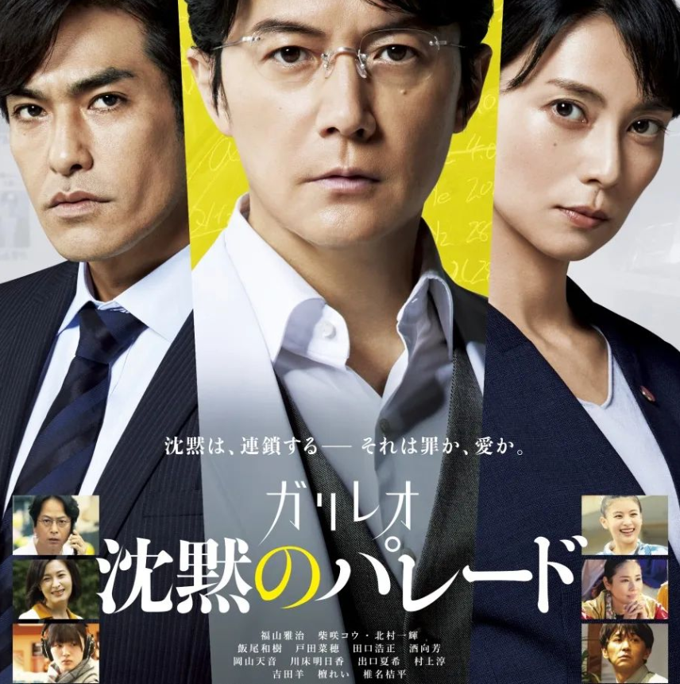

# ガリレオ　沈黙のパレード

> [!CAUTION]
> このページはネタバレを含みます

## きっかけ

研究室の先輩のおすすめ

## 媒体

プライムビデオ

## おとも

バターピーナッツ

## 感想

- 理系活躍映画の代表格！
- 福山雅治かっこええ
- 他のガリレオ映画も観たい。容疑者Xの献身とか見たことあるけどもう覚えてないし
- 湯川の最後まで考え抜く姿勢、真似していきたい
- 数式書くシーン無くて泣泣泣
- 現在の法において、取り調べや裁判で沈黙を貫く人はどのような判断を下されるのか気になった
- 映画の中で事件の真実とされるものが終盤で何回も入れ替わったの「マジか！？」ってなった
- でも、納得できる伏線が張られていて「たしかに」とも思った
    - くそでか人形の強調され具合とか
    - 蓮沼の作業服に付いた血痕とか
    - 奥さんの「全然才能なかったし」とか
- 容疑者多すぎ！って思ってたら全員共犯で笑った
