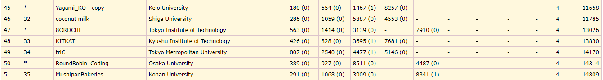
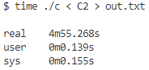
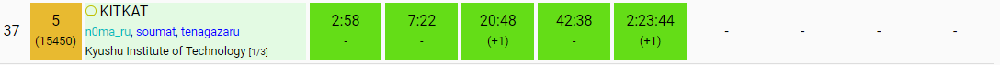

# ICPC2024国内予選参加記（n0ma_ru視点）

投稿日：2024/10/04

## はじめに

---

[tenagazaru](https://atcoder.jp/users/tenagazaru)と[soumat](https://atcoder.jp/users/soumat)と一緒にチーム**KITKAT**としてICPC2024国内予選に参加した。このチームで参加するのは2年目になる。去年のことも含めてこの記事に書きたいと思う。

## チームメンバー紹介

---

個人的に他の方のICPC参加記内のチームメンバー紹介の欄を読むのが好き。なので自分は長めに書いてみようと思う。紹介は国内予選参加時のAtCoderレート順。

- **tenagazaru（AtCoder: 1885）青3**
    - OMCプレイヤーであることもあり数学的考察が3人の中で一番できる
    - 演習量が多く、典型力がある
    - 考察の一手目が速い
    - 下振れしてもパフォーマンスが高く、KITKATの安定感担当
    - コードテスト派
    - 幣学競プロサークル部長

- **soumat（AtCoder: 1847）青3**
    - ヒューリスティック黄
    - 考察にヒューリスティックっぽさがある「こういう性質満たしてほしいな～」「こういう貪欲ありそう」等
    - バグ発見力が高い
    - ARC・AGCでレートを爆上げしてるイメージがある
    - 上振れした時の爆発力が高い

- **n0ma_ru（AtCoder: 1596）水4**
    - この記事の筆者
    - 他二人が「競プロの楽しさは考察で、実装はしたくない派」であることもあり、レートは最下位だが実装を担当することが多い
    - 幾何・構文解析も実装担当

## 去年のICPC

---

　去年のチーム結成時はsoumatと自分は顔見知りで、tenagazaruとは初対面だった。このときは全員が緑コーダーだった。自分がレートが最も高かったこともあり実装は全て自分が担当した。（今ではチーム内最下位ですが、、、😢）

　国内予選では、C問題の天才構築をsoumatが解き、自分が実装をして68位だった。同校制限によりギリギリ50位でアジア予選に進出した。通るとは思っておらずびっくり。

　11月末にあったアジア予選のころには全員水色コーダーになっていた。何位だったか覚えてないほど低い順位をとって、去年のICPCは終了した。来年もアジア予選に出たいなと強く思ったことだけ覚えてる。

## 今年のICPC

---

　去年に引き続きこの3人でICPCに出ることにした。3人とも同じ研究室に配属されたことにより、研究室というICPCチーム練習場所を確保することに成功。今年度は毎週土曜日に集まって国内予選の過去問を解く練習をしたり、平日は1時間で青diff2問解くバチャをやったり（これは最近やってない）、大学コン出たり、チームヒューリスティックのコンテスト出たり、ライブラリを作ったり、いっぱい競プロをやった。複数人で競プロやるの楽しすぎて一人での精進が面倒だと思い始めるくらいだった。

## 模擬国内

---

　そんなこんなで国内予選一週間前になった。実感が湧かないながらも模擬国内に出場した。tenagazaruは用事があり、soumatとデュオ参加だった。結果は画像の感じだった。E問題を通したかったが、国内予選を突破するためにはまあ悪くない結果だと感じた。

C問題で最悪で $3 \times 10^9$ 回の計算を行うコードでギリギリACし、6分ルールの怖さを思い知らされた。

## 国内予選中の様子（時系列）

---

事前に戦略として話していたのはA問題をみんなで見て分かった人が解く。それ以降は

- 基本的に「実装一人考察二人」
- バグったら「実装二人考察一人」
- もっとバグったら「実装三人」

と決めていた。

### 開始直前

本番はめちゃくちゃ緊張するタイプでずーーーーーっとそわそわしてた。KitKatというお菓子を食べた。

### A問題

自分が問題を読み終わる前にsoumatが書き始めた。AC

### B問題

直前の状態を持てばOK。自分が実装してAC。

### C問題

最近のABCで見たやつだった。tenagazaruが実装してAC。

### D問題

最初の $4\times100\times100$ 回シミュレーションすれば、ループするか外に出るからそれを自分が実装した。いくつかバグが出たがsoumatと一緒にデバッグしAC。この時点でE問題以降を通しているチームはおらず、かなり順調だった。

### E問題

左上1/4を貪欲に色塗りして点対称にコピーすればいいんじゃね？で自分が実装してWA。この実装にもめちゃくちゃ時間かかってて泣きそうだった。左上1/4に収まらないケースがあることが発覚し、tenagazaruが一から書き直してAC。申し訳なさで潰れそうだった。まじでありがとう 🙇🙇🙇🙇🙇🙇

### F問題

tenagazaruがE問題を実装している間、F問題を考察し始めた。答えは高々4つだと気づいた。衝突は拡張ユークリッドの互除法で判定できるというのをtenagazaruが気づいたが、どのボールが最もコインに近いかの判定を詰め切れずコンテスト終了。

結果はABCDEの5完の37位＋学内1位で予選突破してそう。順位の変動は下の画像のような感じだったらしい（https://icpc-replay.vercel.app/chart?contest=2024_domestic&team=KITKAT）

## 今後について

---

　アジア予選が開催される12月末まであと約半年間ある。個人としてはとりあえず青コーダーになりたい。蟻本の勉強や苦手としてるARC・AGCの練習も積みたい。あと幾何力ももっとレベルアップしたい（アジア予選では出題されると信じて）。

　自分は来年就職するのでこのチームでやるのは最後になる。アジア予選で勝ち残ればもっと長い間3人で競プロできるらしい。今の実力のままではplayoff進出は厳しいが頑張りたい。

## この記事を読んだ人は以下の記事も読んでいます

- https://note.com/super_magpie2889/n/nbbc5b0ef4328
- https://kureha908.hatenablog.com/entry/2024/07/06/132616
- https://shinchankosen.hatenadiary.jp/entry/2024/07/06/033309
- https://pro-anyone.hatenablog.com/entry/2024/07/06/041033
- https://trap.jp/post/2275/
- https://trap.jp/post/2278/
- https://trap.jp/post/2274/
- https://trap.jp/post/2273/
- https://trap.jp/post/2276/
- https://miscalc.hatenablog.com/entry/2024/07/06/020650
- https://logk.hateblo.jp/entry/2024/07/06/020949
- https://tk0-math.hatenablog.com/entry/2024/07/06/013152
- https://yuma220284.hatenablog.com/entry/2024/07/06/013601
- https://winter-2521.hatenablog.com/entry/2024/06/30/201254?_gl=1*1btt3ec*_gcl_au*MTkyOTk0MzIzNy4xNzE5NzQxNzM3
- https://winter-2521.hatenablog.com/entry/2024/07/06/165918?_gl=1*1etkbl9*_gcl_au*MTkyOTk0MzIzNy4xNzE5NzQxNzM3
- https://sotanishy.hatenablog.com/entry/2024/07/07/010437
- https://karinohito.hatenablog.com/entry/2024/07/07/002044
- https://note.com/uruzunyaa/n/n0d1a67afbef3?sub_rt=share_pb
- https://cpbm-p.hatenablog.com/entry/2024/07/07/194829
- https://yukun-py.hatenablog.com/entry/2024/07/07/202248
- https://hackmd.io/@atree/icpc_domestic2024
- https://koutykkk.hatenablog.com/entry/2024/07/07/170714
- https://titan-23.hatenablog.com/entry/2024/07/07/150400
- https://a01sa01to.com/articles/2024/07/icpc2024-prelim/
- https://today-or-yesterday.hatenablog.com/entry/2024/07/07/043347
- https://halss.hatenablog.com/entry/2024/07/07/004020
- https://kyushu-u-icpccc.hatenablog.com/entry/2024/07/10/024150
- https://super-ryuneng.hatenablog.com/entry/2024/07/09/001545